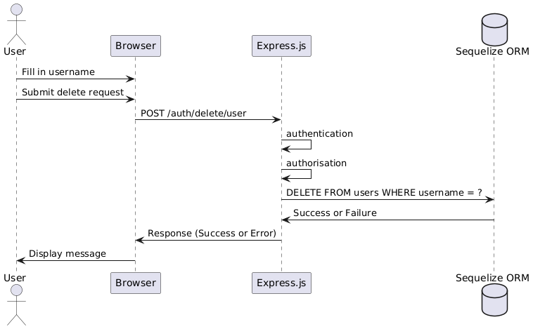

# Challenge Part 1: Delete User Functionality

## Overview
This script provides a basic implementation of a "Delete User" feature, where any user can delete any other user after authentication. This is done to simulate a scenario where users have significant control, allowing for potential "havoc." The script integrates backend and frontend code, ensuring the functionality works seamlessly.

## Code Explanation

### Backend Implementation

The backend code is responsible for handling the delete request, authenticating the user, checking their authorization, and then performing the deletion if the checks pass.

#### deleteuser.js

```javascript
// Import required modules
const express = require("express");
const router = express.Router();
const UserModel = require("../models/UserModel");
const authController = require("../controllers/authController");

// Controller function to delete user by username
authController.delete_user_by_username = async (req, res) => {
    try {
        const { username } = req.body;

        // Delete user from the database
        await UserModel.destroy({
            where: { username: username }
        });

        // Send success response
        res.status(200).send({ message: "User deleted successfully." });
    } catch (error) {
        res.status(500).send({ error: "An error occurred while deleting the user." });
    }
};

// Route to handle delete user request
router.post(
    "/delete/user",
    authentication, // Ensure the user is authenticated
    authorisation({ isAdmin: false }), // Check user is authorized to perform this action
    (req, res) => authController.delete_user_by_username(req, res),
);

module.exports = router;


### Frontend Implementation

The frontend code provides a simple user interface where the user can input a username and submit a request to delete that user. Upon submission, the form triggers the backend to perform the deletion.

```javascript
// Handle form submission to delete user
document.getElementById("delete-user-form").addEventListener("submit", async (event) => {
    event.preventDefault();
    const username = document.getElementById("other-username").value;

    // Send delete request to backend
    const response = await fetch(`http://localhost:4001/auth/delete/user`, {
        method: "POST",
        headers: {
            "Content-Type": "application/json"
        },
        body: JSON.stringify({
            username
        })
    });

    // Handle the response
    if (response.ok) {
        alert("User deleted successfully.");
    } else {
        alert("Failed to delete user.");
    }
});
```

## Challenge Part 2: Authentication Requirement

### Is this a good idea?
The requirement that "This delete user functionality can be done after authentication" is a **bad idea** if not carefully implemented. Authentication alone verifies the identity of the user, but it doesn't verify whether the user has the rights to perform the requested action (which is where authorization comes in). Allowing any authenticated user to delete any account can lead to significant security risks, including the possibility of malicious actions where users could delete each other's accounts.

### Authentication vs. Authorization

- **Authentication** is the process of verifying the identity of a user. It ensures that the user is who they claim to be, typically through credentials like a username and password.
  
- **Authorization** is the process of determining what an authenticated user is allowed to do. It ensures that the user has the necessary permissions to perform a specific action.

While authentication is necessary to identify users, authorization is crucial to protect resources and ensure that users only perform actions they are permitted to do. Without proper authorization, sensitive operations like deleting users could be abused, leading to compromised system integrity.

### Sequence Diagram

To better illustrate the flow of the delete user functionality, here's a sequence diagram that outlines the process:


```

